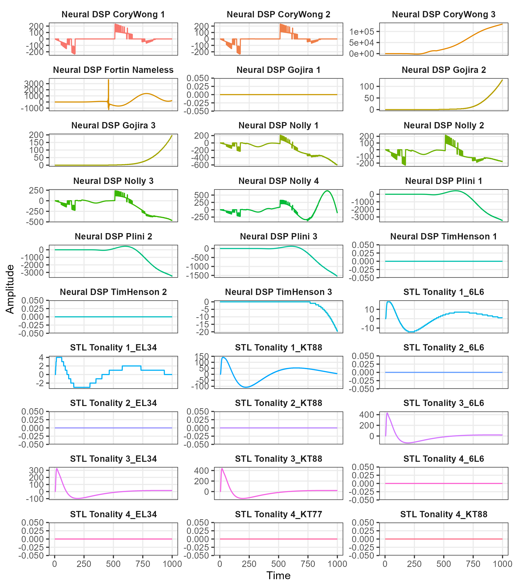
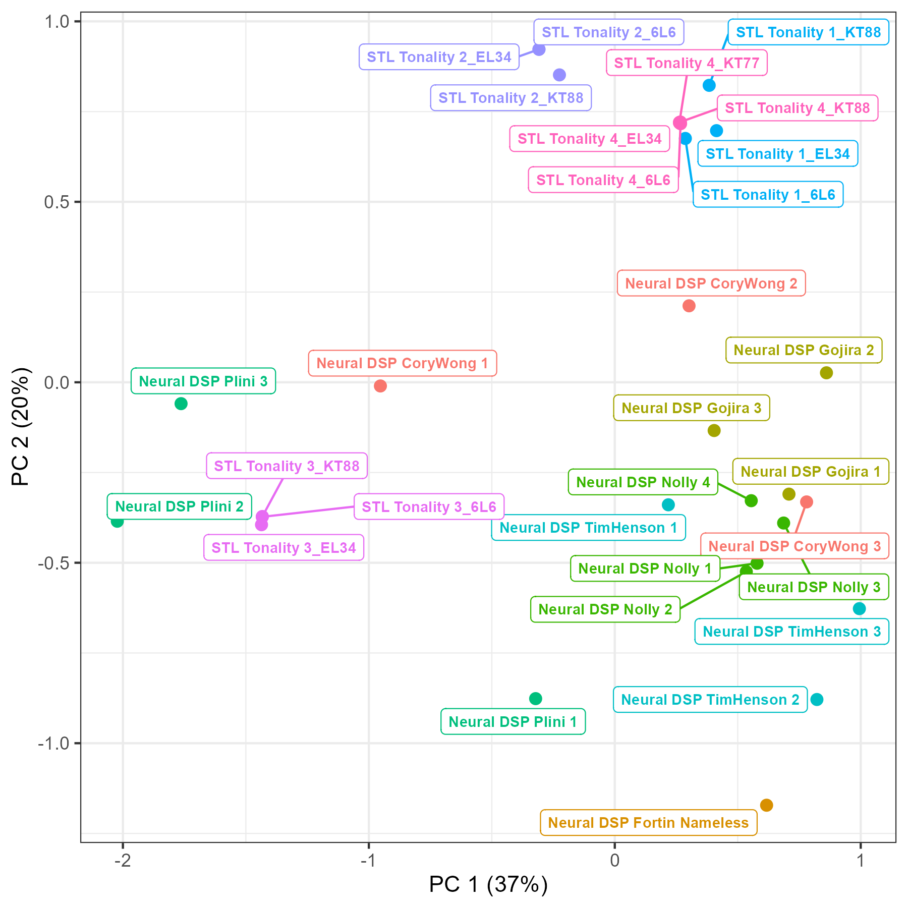
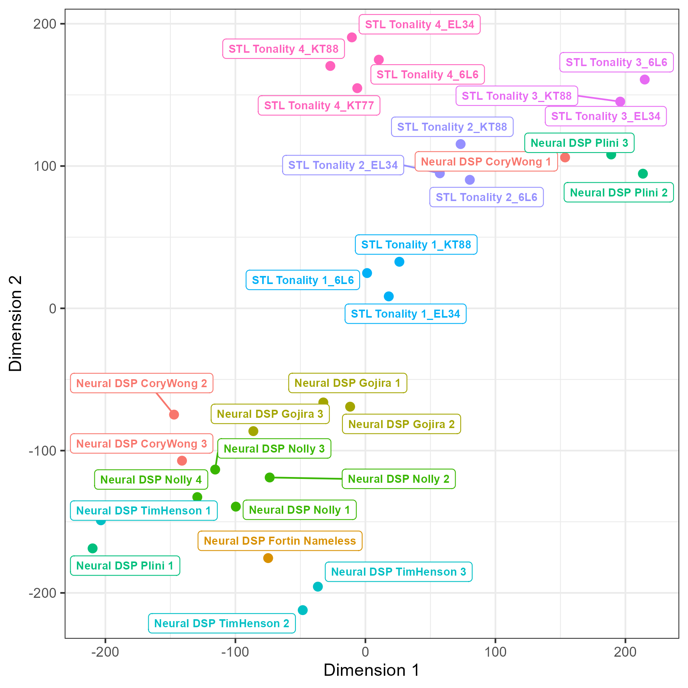
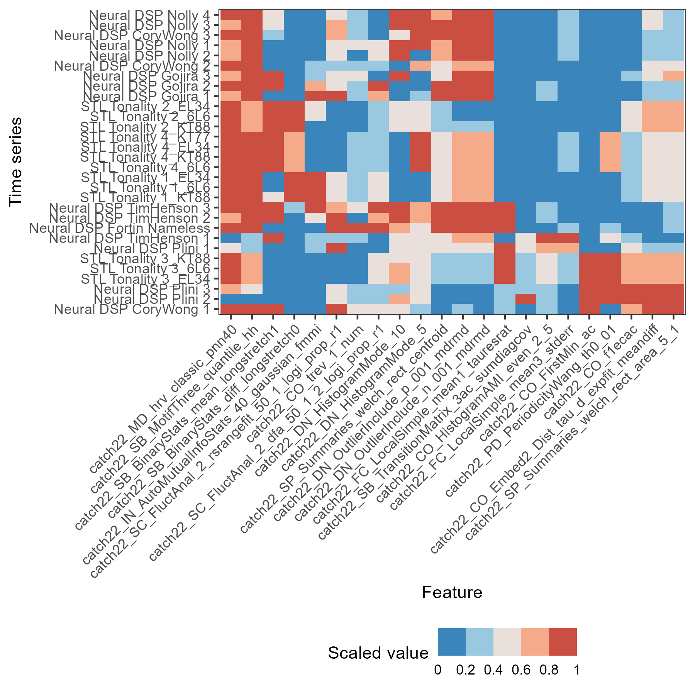
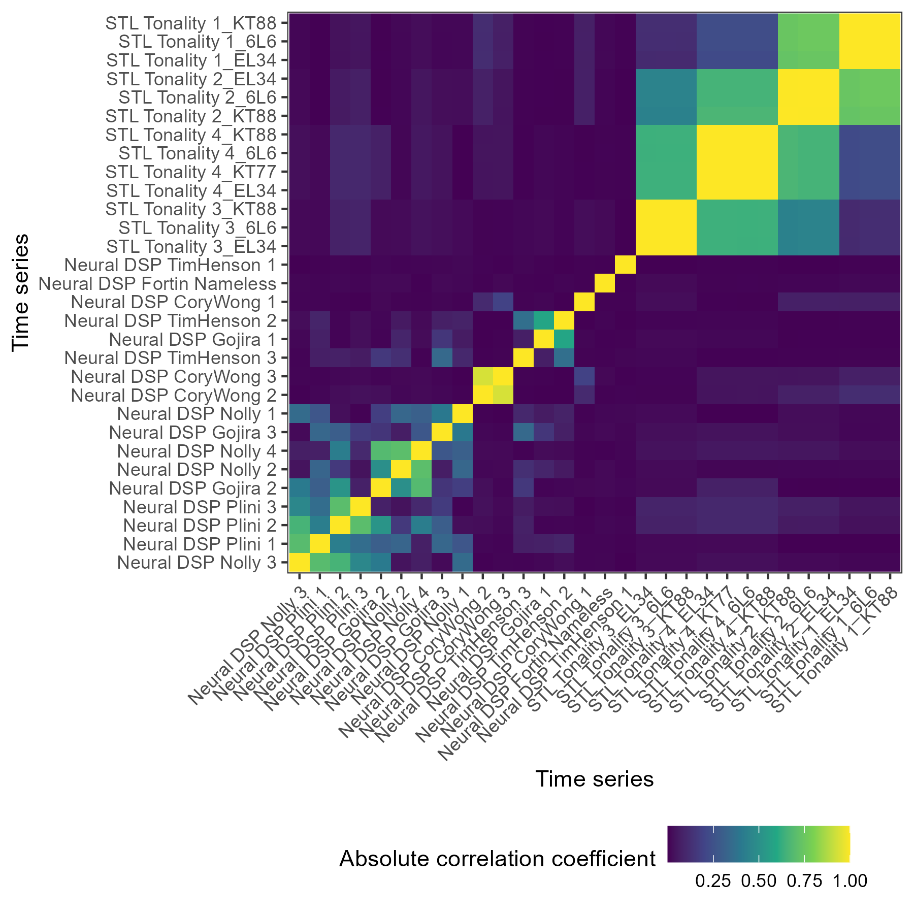
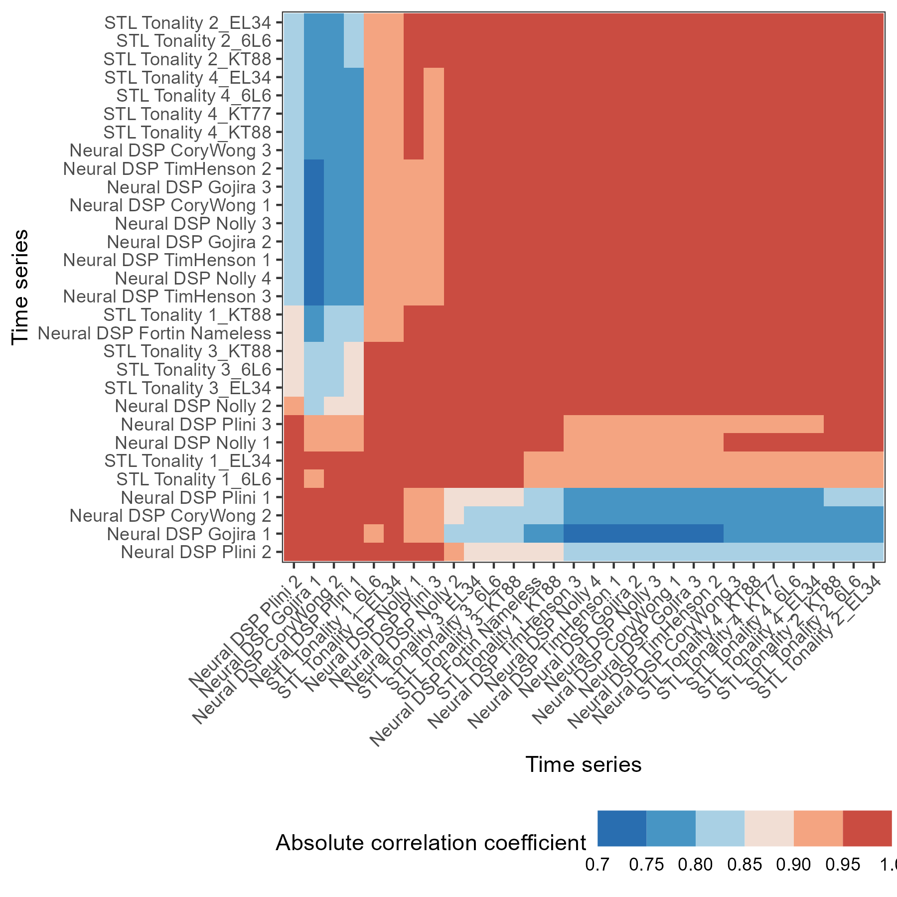

```{r setup, include=FALSE}
knitr::opts_chunk$set(echo = TRUE)
```

# Executive summary

The availability of guitar plugins for a plethora of tonal qualities has soared over recent years, with Neural DSP pushing the boundaries at the forefront of algorithm development of such plugins. Similar to physical amplifiers, choices are endless, but musicians are highly skilled in distinguishing between options, preferring one amplifier due to its gain structure, or another due to its rounded bottom end. However, as yet, little quantitative research has been done into the factors which distinguish an amplifier (or plugin) from another. For the first time, this work uses feature-based time-series analysis to understand similarity between Neural DSP plugins and that of a competitor. It was found that various amplifier heads within separate plugins (e.g., heads within Archetype: Nolly) cluster together based on a set of general temporal properties of their signal. This provides a novel lens through which to understand digital signal processing technologies and a quantitative way to measure uniqueness of a new product or similarity to an existing benchmark product.

# Introduction

XX

## Feature-based time-series analysis

XX

### The catch22 feature set

XX

# Method

XX

```{r timeseries, echo = FALSE, fig.cap = "Amplitude plot over time for first 1000 samples for each amplifier head", fig.dim = c(7, 8), out.width = "75%", out.height = "75%"}

```

# Results

XX

## Low-dimensional projection

XX

### Linear dimensionality reduction

XX

```{r lowdim1, echo = FALSE, fig.cap = "Low dimensional projection of amplifier head time-series features using principal components analysis", fig.dim = c(6, 6), out.width = "75%", out.height = "75%"}

```

### Non-linear dimensionality reduction

XX

```{r lowdim2, echo = FALSE, fig.cap = "Low dimensional projection of amplifier head time-series features using t-SNE", fig.dim = c(6, 6), out.width = "75%", out.height = "75%"}

```

## Data matrix visualisation

XX

```{r matplot, echo = FALSE, fig.cap = "Time-series by feature data matrix", fig.dim = c(6, 6), out.width = "75%", out.height = "75%"}

```

## Plugin correlations

XX

### Pairwise time-series correlations

XX

```{r corplot, echo = FALSE, fig.cap = "Time-series by time-series correlations between amplifier heads on the time domain", fig.dim = c(6, 6), out.width = "75%", out.height = "75%"}

```

### Pairwise time series feature vector correlations

XX

```{r corvecplot, echo = FALSE, fig.cap = "Time-series by time-series correlations between amplifier heads in feature space", fig.dim = c(6, 6), out.width = "75%", out.height = "75%"}

```

# Conclusion

XX
