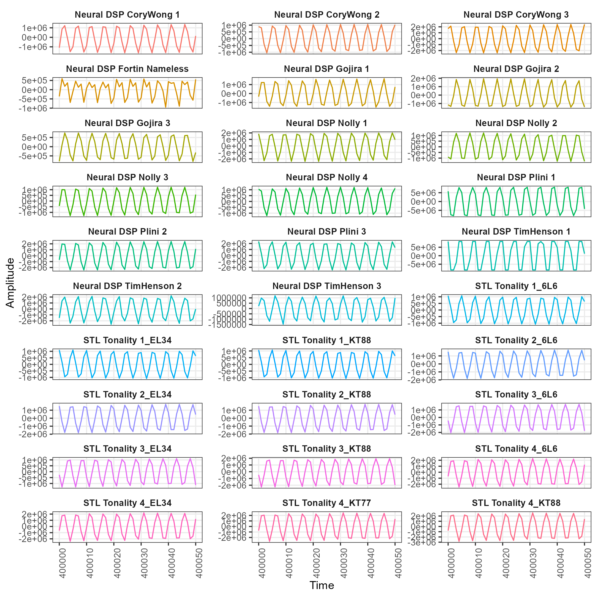
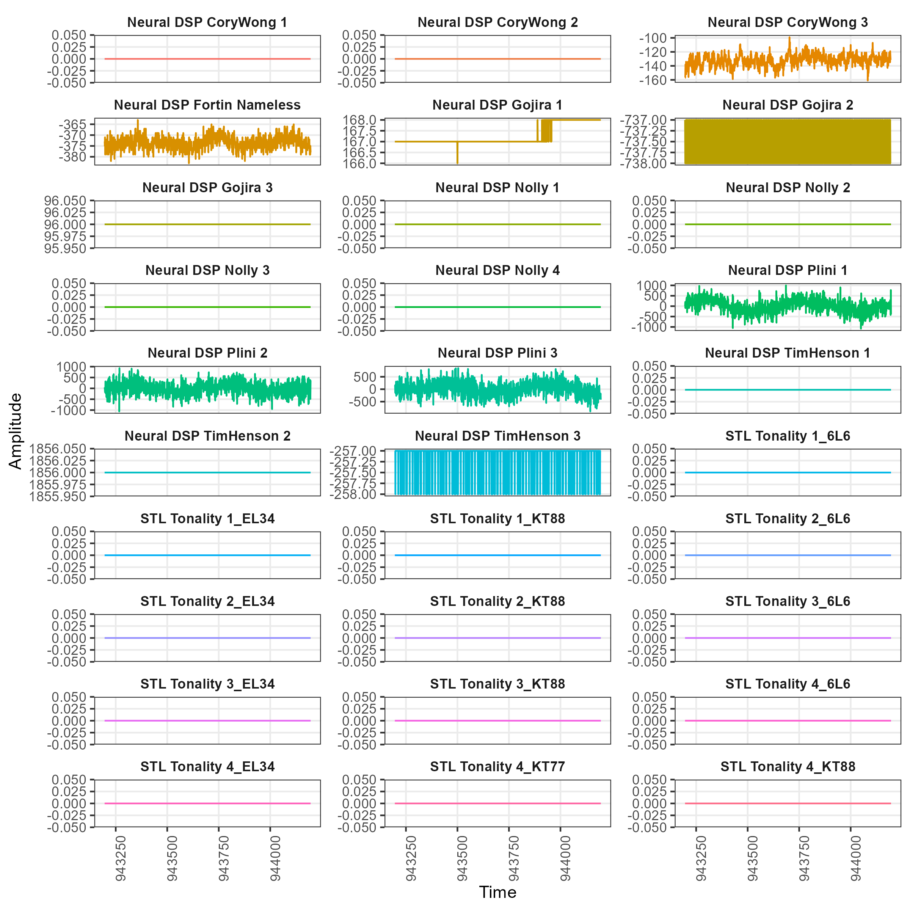

```{r setup, include=FALSE}
knitr::opts_chunk$set(echo = TRUE)
```

# Executive summary

The availability of guitar plugins for a plethora of tonal qualities has soared over recent years, with Neural DSP pushing the boundaries at the forefront of algorithm development of such plugins. Similar to physical amplifiers, choices are endless, but musicians are highly skilled in distinguishing between options, preferring one amplifier due to its gain structure, or another due to its rounded bottom end. However, as yet, little quantitative research has been done into the factors which distinguish an amplifier (or plugin) from another. For the first time, this work uses feature-based time-series analysis to understand similarity between Neural DSP plugins and that of a competitor. It was found that various amplifier heads within separate plugins (e.g., heads within Archetype: Nolly) generally cluster together based on a set of general temporal properties of their signal, and plugins within a brand (i.e., Neural DSP) tend to cluster together distinctly from another (i.e., STL Tonality). These findings provide a novel, statistically sophisticated lens through which to understand digital signal processing technologies and contribute a quantitative way to measure uniqueness of a new product or similarity to an existing benchmark.

# Introduction

The guitar plugin landscape is an exciting, surging market with many competitors and even more offerings, each claiming to be the one tool a guitarist or producer is missing in their lives. For the most part, these claims are warranted, and the tonal diversity at the hands of even a young teenage prodigy with minimal income are a far cry from the days of old where people saved for months or even years to afford a Mesa/Boogie Dual Rectifier Road King in an attempt to get John Petrucci's legendary tone from 'Train of Thought'. Now, one only needs to spend €149 to get a vast array of Petrucci tones in an instant through products such as Neural DSP's Archetype: Petrucci. However, while guitarists often 'know' --- either through experience of intuition --- what an amplifier (or its plugin equivalent) will likely sound like (and whether a product is worth spending their money on), there has been little research conducted into developing a quantitative understanding of this knowledge. While understanding amplifier circuitry at a component or physics level would certainly shed light on the differences between them, such a task is both physically unfeasible to conduct on a large scale, and also prohibitive in that only a small sample of the guitar-playing population would even know how to handle the inner machinery of an amplifier. Companies such as Neural DSP, though, have developed plugin software that is so advanced and life-like so as to be indistinguishable from the real amplifier which it models. This opens the door to a wealth of analytical options that would be otherwise impossible.

This work comprises the first (to the best of our knowledge) statistical investigation of the following question: *How similar are guitar plugin amplifiers?* As described in the Method section below, we focus only amplifier heads only in this work. Specifically, we decompose the research question into a few parts: (i) How similar are individual heads within plugins?; (ii) How similar are heads between plugins?; (iii) How similar are heads between software companies? To explore all of these questions, we generated a time series of amplitude for each plugin and employed a novel form of time-series analysis known as a 'feat-based approach'.

## Feature-based time-series analysis

Time series that are sampled uniformly through time (i.e., at a constant sampling period, $\Delta t$) can be written as an ordered vector $x = (x_{1}, x_{2}, \dots , x_{N})$. Time-series analysis is typically concerned with extracting information from these vectors or summarising them in some manner to use for analysis One approach that has gained much traction in scientific literature over the past decade is to extract from each time series a set of interpretable summary statistics or 'features', where each feature is a single numerical value. Using this procedure, a collection of univariate time series can be represented as a time series $\times$ feature matrix which can be used as the basis for a range of conventional statistical learning procedures. Examples of time-series features include simple properties such as moments of the distribution (e.g., mean, skew, kurtosis) through to more sophisticated quantities such as values of the autocorrelation function (i.e., how correlated is each time point to the one previous, or the two previous, etc.), stationarity (the statistical process which generated the time series do not change over time), entropy, parameters from statistical model fits, and many more. Because time-series features summarise a given method of analysis, there are thousands of available features to calculate, spanning the breadth of science. Further, because a time-series feature is a mathematical calculation driven by theory, it means they are *interpretable* properties and not a black box --- e.g., if a basic linear support vector machine classifier is trained on data from two populations using values of the autocorrelation function at lag 1 and finds a perfect separation boundary, we can directly interpret the meaning relative to the feature, as a high autocorrelation coefficient means each point is serially correlation with the one previous, and vice versa. This feature-based time-series analysis a desirable approach for applied settings where explainability is important.

In this paper, we apply a feature-based approach to conduct an exploratory analysis of a sample of Neural DSP plugins as well as a competitor offering ([STL Tonality Will Putney](https://www.stltones.com/products/stl-tonality-will-putney-guitar-plug-in)). This represents (to the best of our knowledge) the first time such an approach has been used on digital signal processing data, especially that of virtual guitar amplification plugins. To do so, we employ a recent open-source software package for R called [`theft`](https://hendersontrent.github.io/theft/) ('Tools for Handling Extraction of Features from Time series') developed by the author of the present work (please see the [arXiv paper](https://arxiv.org/abs/2208.06146) for more information). `theft` unifies six open-source time-series feature sets (collections of time-series features) from both Python and R into a single R interface and provides an end-to-end pipeline for conducting feature-based time-series analysis --- taking the user from data loads to feature extraction to a diverse array of feature processing, statistical analysis, and data visualisation tools. We use the [`catch22`](https://link.springer.com/article/10.1007/s10618-019-00647-x) feature set only in this paper due to its computational efficiency of being coded in C underneath the R package ([`Rcatch22`](https://github.com/hendersontrent/Rcatch22)) it sits in.

### The catch22 feature set

The 22-feature `catch22` set was generated from a broader set of $>7700$ features available in a Matlab package known as [`hctsa`](https://github.com/benfulcher/hctsa) ('highly comparative time-series analysis'). This reduced set was created through a feature selection pipeline where a subset was chosen to be minimally redundant (i.e., sensitive to different temporal properties; not strongly correlated with one-another) and highly performant in time-series classification settings. The result is a general set of 22 features that can be used with reasonable confidence out-of-the-box in a variety of applied settings. Indeed, `catch22` has seen success in a multitude of domains, such as classification of seizure state using electroencephalogram data, classification of zebra finch motifs, and distinguishing star types from light curves measures on the NASA Kepler mission. Its features include properties from ten different categories:

* Histogram shape
* Spacing of extreme events
* Linear autocorrelation function
* Periodicities
* Non-linear autocorrelation
* Consecutive stretches
* Simple forecasting
* Incremental differences
* Self-affine scaling
* Symbolic features

This diversity (and computational efficiency) makes `catch22` the ideal candidate to test for the first time in a DSP setting in an attempt to quantify the similarity of different guitar plugins.

# Method

The first part of the pipeline for this work was to extract a time-series vector from each plugin. But each plugin has substantial complexity --- multiple amplifier heads, pedals, cabinets, and effects. To simplify the analysis, we focus *exclusively on amplifier heads*. For example, for the Archetype: Tim Henson plugin, three separate time series would be extracted, one for each amplifier (Acoustic, Rhythm, and Lead). To ensure consistency between amplifiers and plugins, we disable all cabinets and effects (to isolate the head) and set all dials to noon. In order to extract a consistent time series for each amplifier without interference or noise of human playing, we passed a simple 20Hz-20kHz sine sweep through each amplifier to capture the sonic spectrum. This produced an amplitude time series of $T = 944\,196$ samples for each. As this work was conducted largely during a 2021 lockdown in Australia, the following amplifiers were analysed:

* Archetype: Nolly (Neural DSP) --- 4 amplifiers
* Archetype: Gojira (Neural DSP) --- 3 amplifiers
* Archetype: Cory Wong (Neural DSP) --- 3 amplifiers
* Archetype: Plini (Neural DSP) --- 3 amplifiers
* Archetype: Tim Henson (Neural DSP) --- 3 amplifiers
* Fortin Nameless (Neural DSP) --- 1 amplifier
* STL Tonality Will Putney (STL Tones) --- 4 amplifiers with 3-4 tube settings for each

While this coverage does not include the entirety of the Neural DSP suite of plugins, nor certainly not the extense range of competitor products, future work will hopefully encompass more of the market. It is intended that a library of amplifier signals can be constructed such that new products can be added and analysed in real time, similar to the [CompEngine](https://www.comp-engine.org) library of time series. All code and files for this work are openly available on [GitHub](https://github.com/hendersontrent/amp-sim-comp).

# Results

XX

```{r timeseries, echo = FALSE, fig.cap = "Amplitude plot over time for first 1000 samples for each amplifier head", fig.dim = c(8, 8), out.width = "75%", out.height = "75%"}
knitr::include_graphics("time-series.png")
```

XX

```{r timeseries2, echo = FALSE, fig.cap = "Amplitude plot over time for first middle range of 50 samples for each amplifier head", fig.dim = c(8, 8), out.width = "75%", out.height = "75%"}

```

XX

```{r timeseries3, echo = FALSE, fig.cap = "Amplitude plot over time for last 1000 samples for each amplifier head", fig.dim = c(8, 8), out.width = "75%", out.height = "75%"}

```

## Low-dimensional projection

XX

### Linear dimensionality reduction

XX

```{r lowdim1, echo = FALSE, fig.cap = "Low dimensional projection of amplifier head time-series features using principal components analysis", fig.dim = c(6, 6), out.width = "75%", out.height = "75%"}
knitr::include_graphics("catch22-low-dim.png")
```

### Non-linear dimensionality reduction

XX

```{r lowdim2, echo = FALSE, fig.cap = "Low dimensional projection of amplifier head time-series features using t-SNE", fig.dim = c(6, 6), out.width = "75%", out.height = "75%"}
knitr::include_graphics("catch22-low-dim-tsne.png")
```

## Data matrix visualisation

XX

```{r matplot, echo = FALSE, fig.cap = "Time-series by feature data matrix", fig.dim = c(6, 6), out.width = "75%", out.height = "75%"}
knitr::include_graphics("timeseries-by-feature-matrix.png")
```

## Plugin correlations

XX

### Pairwise time-series correlations

XX

```{r corplot, echo = FALSE, fig.cap = "Time-series by time-series correlations between amplifier heads on the time domain", fig.dim = c(6, 6), out.width = "75%", out.height = "75%"}
knitr::include_graphics("correlation-matrix.png")
```

### Pairwise time series feature vector correlations

XX

```{r corvecplot, echo = FALSE, fig.cap = "Time-series by time-series correlations between amplifier heads in feature space", fig.dim = c(6, 6), out.width = "75%", out.height = "75%"}
knitr::include_graphics("correlation-matrix-feature.png")
```

# Conclusion

XX
